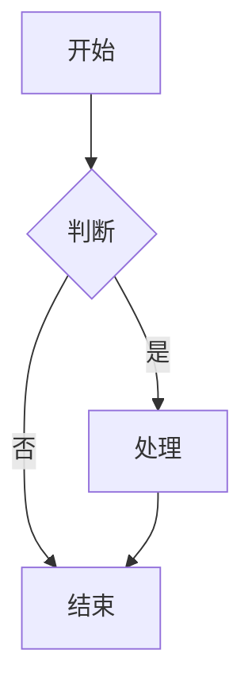

# TashaStone 用户指南

> 版本: V1.77
> 最后更新: 2026-01-02
> 语言支持: 中文 / English

---

## 目录

1. [快速开始](#1-快速开始)
2. [编辑器功能](#2-编辑器功能)
3. [AI 对话功能](#3-ai-对话功能)
4. [知识管理](#4-知识管理)
5. [学习功能](#5-学习功能)
6. [上下文管理](#6-上下文管理)
7. [快捷键](#7-快捷键)
8. [设置说明](#8-设置说明)
9. [常见问题](#9-常见问题)

---

## 1. 快速开始

### 1.1 安装与启动

**Windows**:
1. 下载 `TashaStone-Setup.exe`
2. 双击安装程序
3. 启动 TashaStone

**Linux**:
```bash
# AppImage
chmod +x TashaStone.AppImage
./TashaStone.AppImage

# Deb
sudo dpkg -i TashaStone.deb
```

### 1.2 首次配置

1. **设置 AI 模型**
   - 点击工具栏的 ⚙️ 按钮
   - 选择 AI 提供商 (Gemini / OpenAI / Ollama / Anthropic)
   - 输入 API Key
   - 保存配置

2. **打开文件夹**
   - 点击侧边栏的 📁 按钮
   - 选择你的笔记文件夹
   - TashaStone 会自动扫描所有 Markdown 文件

3. **创建第一个笔记**
   - 右键点击侧边栏空白处
   - 选择 "新建文件"
   - 输入文件名

### 1.3 界面布局

```
┌─────────────────────────────────────────────────────────┐
│                     工具栏 (Toolbar)                     │
├─────────┬───────────────────────────────────┬───────────┤
│         │                                   │           │
│  侧边栏  │         编辑器 / 预览区            │  AI 对话  │
│ Sidebar │        Editor / Preview           │   Chat    │
│         │                                   │   Panel   │
│ - 文件树 │   支持分屏模式                      │           │
│ - 标签   │   支持 WikiLink                   │ - 对话    │
│ - 片段   │   支持 Block Reference            │ - 记忆    │
│ - 大纲   │                                   │ - 工具    │
│         │                                   │           │
└─────────┴───────────────────────────────────┴───────────┘
```

---

## 2. 编辑器功能

### 2.1 Markdown 编辑器

TashaStone 提供两种编辑器模式:

| 模式 | 特点 | 快捷键切换 |
|------|------|------------|
| **纯文本编辑器** | 轻量、响应快 | 工具栏按钮 |
| **CodeMirror 编辑器** | 语法高亮、代码补全 | 工具栏按钮 |

**支持的 Markdown 语法:**

```markdown
# 标题 1-6 级
**粗体** *斜体* ~~删除线~~
- 无序列表
1. 有序列表
- [ ] 任务列表
> 引用
`代码` ```代码块```
[链接](url) 
| 表格 | 支持 |
数学公式: $E=mc^2$ 或 $$\sum_{i=1}^n$$
```

### 2.2 WikiLink 双向链接

TashaStone 支持 Obsidian 风格的双向链接:

| 语法 | 说明 | 示例 |
|------|------|------|
| `[[文件名]]` | 标准链接 | `[[项目计划]]` |
| `[[文件名\|别名]]` | 带别名链接 | `[[项目计划\|我的计划]]` |
| `[[Exam:测试名]]` | 试题链接 | `[[Exam:Python基础]]` |
| `[[Question:题目ID]]` | 问题链接 | `[[Question:Q001]]` |

**特性:**
- 悬浮预览 (500ms 延迟)
- 存在的链接显示为青色
- 不存在的链接显示为橙色
- 点击可导航到目标文件

### 2.3 Block Reference 块引用

引用其他文件的特定行:

```markdown
(((文件名#行号)))        # 引用单行
(((文件名#起始-结束)))   # 引用多行
```

**示例:**
```markdown
(((项目计划#15)))        # 引用第15行
(((代码笔记#42-50)))     # 引用42-50行
```

### 2.4 实时预览

预览功能支持:

- **Mermaid 图表** - 流程图、时序图、甘特图
- **LaTeX 数学公式** - 行内和块级公式
- **代码高亮** - 100+ 语言支持
- **HTML 渲染** - 可选开启 (右上角开关)

**Mermaid 示例:**


### 2.5 分屏模式

| 模式 | 说明 | 快捷键 |
|------|------|--------|
| **无分屏** | 单窗口显示 | - |
| **水平分屏** | 左右并排 | 工具栏按钮 |
| **垂直分屏** | 上下并排 | 工具栏按钮 |

分屏时可独立切换每个窗格的编辑/预览模式。

---

## 3. AI 对话功能

### 3.1 支持的 AI 提供商

| 提供商 | 模型示例 | 特点 |
|--------|----------|------|
| **Gemini** | gemini-2.0-flash | Google 最新模型, 支持视觉 |
| **OpenAI** | gpt-4o, gpt-4o-mini | GPT 系列模型 |
| **Anthropic** | claude-3.5-sonnet | Claude 系列 |
| **Ollama** | llama3, qwen2.5 | 本地运行, 隐私保护 |
| **兼容 API** | DeepSeek, Groq 等 | OpenAI 兼容接口 |

### 3.2 对话面板

**功能:**
- 流式响应显示
- Markdown 渲染
- 代码块复制
- 消息编辑/删除
- 历史记录保存

**操作:**
- 发送消息: 输入框 + Enter
- 换行: Shift + Enter
- 清空对话: 点击 🗑️ 按钮
- 语音输入: 点击 🎤 按钮

### 3.3 记忆注入

TashaStone 支持长期记忆功能:

1. **自动记忆搜索** - AI 会在回复前搜索相关记忆
2. **手动注入** - 点击 💉 按钮选择要注入的记忆
3. **记忆管理** - 在记忆面板查看/编辑/删除记忆

**记忆类型:**
- 短期记忆 - 当前对话
- 中期记忆 - 跨会话缓存
- 长期记忆 - 永久存储的重要信息

### 3.4 RAG 检索增强

基于向量数据库的智能检索:

1. **索引文件** - 选中文件右键 "添加到 RAG 索引"
2. **语义搜索** - AI 会自动检索相关内容
3. **查看结果** - RAG 结果卡片显示匹配片段

### 3.5 MCP 工具调用

支持 Model Context Protocol 工具:

**已集成工具:**
- 文件读写
- 网页搜索
- 代码执行
- 浏览器控制 (Playwright)
- 知识图谱 (Graphiti)
- 思维链推理 (Sequential Thinking)

**配置 MCP:**
参见 [MCP_USAGE.md](./MCP_USAGE.md)

### 3.6 语音输入

两种语音识别方式:

| 方式 | 特点 | 要求 |
|------|------|------|
| **Whisper API** | 云端识别, 高准确率 | OpenAI API Key |
| **Sherpa-ONNX** | 本地运行, 隐私保护 | 下载模型文件 |

---

## 4. 知识管理

### 4.1 文件管理

**侧边栏功能:**
- 📁 文件树浏览
- 🔍 全局搜索
- 📌 固定常用文件
- 🏷️ 标签过滤

**右键菜单:**
- 新建文件/文件夹
- 重命名
- 移动
- 删除
- 添加到 RAG 索引
- 智能整理

### 4.2 知识图谱

可视化文件间的链接关系:

**操作:**
- 拖拽移动节点
- 滚轮缩放
- 点击节点查看详情
- 双击打开文件

**视图模式:**
- File Links - 基于 WikiLink 的链接
- Tag Links - 基于标签的关系

### 4.3 思维导图

从笔记内容自动生成思维导图:

1. 打开目标文件
2. 点击工具栏 "思维导图" 按钮
3. 查看/导出思维导图

### 4.4 标签管理

**标签语法:**
```markdown
#标签名
#嵌套/标签
#中文标签
```

**标签浏览器:**
- 查看所有标签
- 按使用频率排序
- 批量重命名
- 合并标签

### 4.5 智能搜索

**搜索过滤语法:**
```
tag:标签名       # 按标签过滤
type:file        # 按类型过滤 (file/exam)
ext:md           # 按扩展名
after:2025-01    # 修改时间之后
before:2025-12   # 修改时间之前
```

**搜索模式:**
- 即时搜索 - 本地全文搜索
- 语义搜索 - AI RAG 语义匹配

### 4.6 智能整理

AI 辅助笔记整理:

1. 选中文件右键 "智能整理"
2. AI 分析内容并建议:
   - 重要性评分 (1-10)
   - 关键概念
   - 建议标签
   - 建议分类
   - 关联文件

---

## 5. 学习功能

### 5.1 测验系统

从笔记自动生成测验题:

**题型支持:**
- 单选题
- 多选题
- 填空题
- 问答题

**使用方法:**
1. 打开笔记
2. 点击工具栏 "生成测验" 按钮
3. AI 生成测验题目
4. 开始答题
5. AI 评分与反馈

### 5.2 题库管理

**功能:**
- 创建题库
- 导入题目 (CSV 格式)
- 编辑题目
- 删除题库
- 按标签分类

**CSV 格式:**
```csv
题目,选项A,选项B,选项C,选项D,正确答案,解析
什么是变量?,存储数据,打印输出,计算结果,显示文本,A,变量用于存储数据
```

### 5.3 学习计划 (SRS)

间隔重复学习系统:

**艾宾浩斯记忆曲线:**
```
5分钟 → 30分钟 → 12小时 → 1天 → 2天 → 4天 → 7天 → 15天
```

**功能:**
- 自动创建复习计划
- 错题自动加入复习
- 查看待复习任务
- 标记完成状态

### 5.4 错题收集

答错的题目自动收集:

- 查看错题列表
- 重新练习
- 加入复习计划
- 删除错题

---

## 6. 上下文管理

### 6.1 检查点

保存和恢复对话状态:

**创建检查点:**
1. 点击 ChatPanel 右上角的检查点按钮
2. 输入检查点名称
3. 保存

**恢复检查点:**
1. 打开检查点列表
2. 选择要恢复的检查点
3. 确认恢复

### 6.2 Token 监控

实时显示 Token 使用情况:

- 当前对话 Token 数
- 上下文窗口占用比例
- 警告阈值提示

### 6.3 上下文压缩

当对话过长时自动压缩:

**压缩策略:**
- 自动摘要旧消息
- 保留重要上下文
- 可手动触发压缩

### 6.4 缓存监控

查看和管理缓存:

- 嵌入向量缓存
- AI 响应缓存
- 文件索引缓存
- 清理缓存

---

## 7. 快捷键

### 7.1 全局快捷键

| 快捷键 | 功能 |
|--------|------|
| `Ctrl+S` | 保存文件 |
| `Ctrl+Shift+S` | 另存为 |
| `Ctrl+N` | 新建文件 |
| `Ctrl+O` | 打开文件夹 |
| `Ctrl+F` | 全局搜索 |
| `Ctrl+P` | 快速切换文件 |
| `Ctrl+,` | 打开设置 |
| `F11` | 全屏 |

### 7.2 编辑器快捷键

| 快捷键 | 功能 |
|--------|------|
| `Ctrl+Z` | 撤销 |
| `Ctrl+Y` | 重做 |
| `Ctrl+B` | 加粗 |
| `Ctrl+I` | 斜体 |
| `Ctrl+K` | 插入链接 |
| `Ctrl+Shift+K` | 插入代码块 |
| `Tab` | 增加缩进 |
| `Shift+Tab` | 减少缩进 |

### 7.3 AI 对话快捷键

| 快捷键 | 功能 |
|--------|------|
| `Enter` | 发送消息 |
| `Shift+Enter` | 换行 |
| `Ctrl+L` | 清空对话 |
| `Escape` | 停止生成 |

---

## 8. 设置说明

### 8.1 AI 配置

**必填项:**
- Provider (提供商)
- Model (模型名)
- API Key

**可选项:**
- Base URL (自定义接口地址)
- Temperature (创造性, 0-2)
- Max Tokens (最大输出长度)
- System Prompt (系统提示词)

### 8.2 主题设置

5 种内置主题:
- 默认深色
- 默认浅色
- 赛博朋克
- 自然绿
- 学术蓝

支持自定义主题。

### 8.3 语言设置

- 简体中文
- English

### 8.4 编辑器设置

- 字体大小
- 字体家族
- Tab 大小
- 自动保存
- 拼写检查

### 8.5 备份设置

**自动备份:**
- 备份间隔
- 备份保留数量
- 备份位置

**加密备份:**
- 设置备份密码
- 导出加密备份
- 导入加密备份

---

## 9. 常见问题

### Q1: AI 无法连接?

**检查项:**
1. API Key 是否正确
2. 网络是否畅通
3. Base URL 是否正确 (自定义接口)
4. 是否需要代理

### Q2: 文件无法保存?

**检查项:**
1. 文件是否被其他程序占用
2. 是否有写入权限
3. 磁盘空间是否充足

### Q3: WikiLink 不工作?

**检查项:**
1. 语法是否正确 `[[文件名]]`
2. 目标文件是否存在
3. 文件名是否匹配 (不区分大小写)

### Q4: 预览不显示?

**检查项:**
1. 是否切换到预览模式
2. Markdown 语法是否正确
3. 刷新页面尝试

### Q5: 向量索引失败?

**检查项:**
1. 文件是否过大 (>10MB)
2. AI 配置是否正确 (需要嵌入模型)
3. 磁盘空间是否充足

### Q6: 应用崩溃?

**解决方法:**
1. 清除缓存 (设置 → 缓存 → 清除)
2. 重新安装应用
3. 检查日志文件: `%APPDATA%/tashanstone/logs/`

### Q7: 如何重置应用?

**警告: 会删除所有数据!**
1. 设置 → 高级 → 工厂重置
2. 输入当前密码确认
3. 重新启动应用

---

## 附录

### A. 支持的文件格式

| 格式 | 导入 | 导出 |
|------|------|------|
| Markdown (.md) | ✅ | ✅ |
| PDF | ✅ (OCR) | ❌ |
| Word (.docx) | ✅ | ❌ |
| CSV | ✅ (题库) | ✅ |
| JSON | ✅ (备份) | ✅ |

### B. 数据存储位置

| 数据 | Windows 位置 |
|------|--------------|
| 数据库 | `%APPDATA%/tashanstone/zhangnote.db` |
| 向量库 | `%APPDATA%/tashanstone/lancedb/` |
| 记忆 | `%APPDATA%/tashanstone/.memories/` |
| 日志 | `%APPDATA%/tashanstone/logs/` |
| 备份 | `%USERPROFILE%/Documents/TashaStone Backups/` |

### C. 反馈与支持

- GitHub Issues: [github.com/zhangyang-crazy-one/Zhang_Note/issues](https://github.com/zhangyang-crazy-one/Zhang_Note/issues)
- 文档: [docs/PROJECT.md](./PROJECT.md)

---

*TashaStone - AI 驱动的智能笔记应用*
