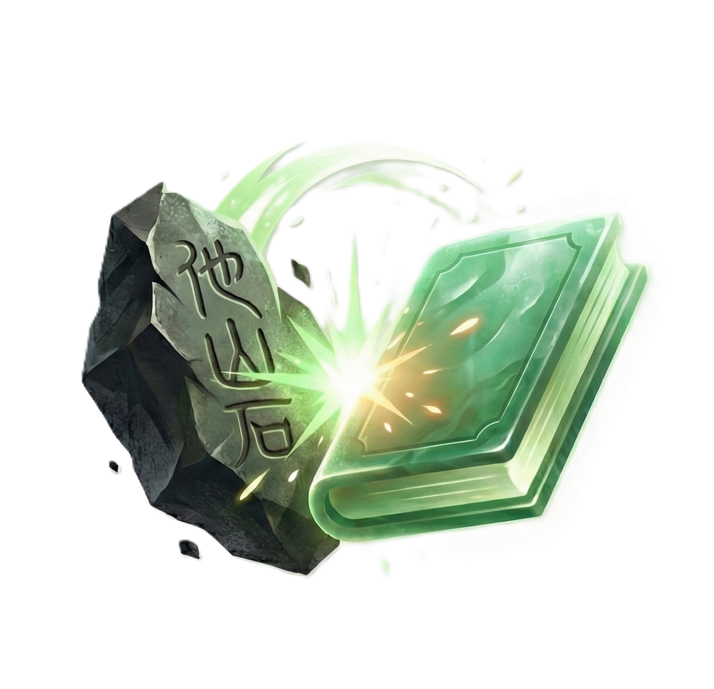
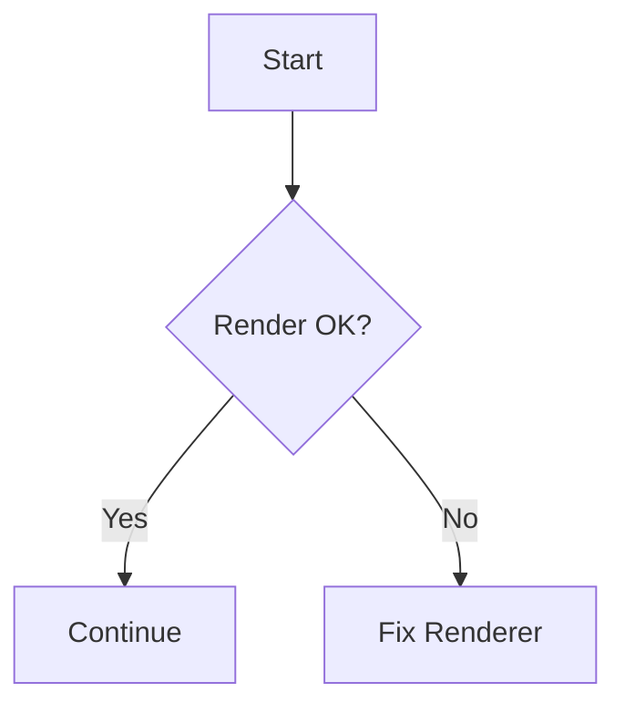

# Markdown Render Test

这个文件用于检查 TUI 中的 Markdown 渲染效果，尽量覆盖常见 CommonMark / GFM / 本项目扩展格式。

---

## 1. Headings

# H1 标题
## H2 标题
### H3 标题
#### H4 标题
##### H5 标题
###### H6 标题

## 2. Paragraphs And Line Breaks

这是一个普通段落，包含中文、English、1234567890，以及符号 `!@#$%^&*()[]{}`。

这一行结尾带两个空格以测试硬换行。  
这里应该是同一段中的下一行。

这是第二个段落。

## 3. Emphasis

- *Italic / 斜体*
- **Bold / 粗体**
- ***Bold Italic / 粗斜体***
- ~~Strikethrough / 删除线~~
- `inline code`
- 组合测试：**粗体里带 `inline code`**，以及 *斜体里带中文*。

## 4. Links

- Markdown 链接：[OpenAI](https://openai.com)
- 带标题链接：[Rust](https://www.rust-lang.org "Rust Language")
- 自动链接：<https://example.com/docs/markdown>
- 邮件链接：<test@example.com>
- 仓库内链接：[用户指南](./USER_GUIDE.md)
- Wiki Link：[[USER_GUIDE]]
- 带别名 Wiki Link：[[USER_GUIDE|打开用户指南]]
- Markdown 文件锚点链接：[跳到表格章节](#10-tables)

## 5. Images


本地图片测试：



## 6. Blockquotes

> 这是一级引用。
>
> 第二行引用内容，测试换行与缩进。

> [!NOTE]
> 这是一个 Obsidian 风格的 callout。
> 如果不支持，应至少以普通引用方式展示。

> 一级引用
>> 二级引用
>>> 三级引用

## 7. Lists

### Unordered List

- 第一项
- 第二项
  - 二级子项 A
  - 二级子项 B
    - 三级子项 B.1
-- 第三项

### Ordered List

1. 第一项
2. 第二项
3. 第三项
   1. 子项 3.1
   2. 子项 3.2

### Task List

- [ ] 未完成任务
- [x] 已完成任务
- [ ] 带中文说明的任务项

## 8. Horizontal Rules

---

***

___

## 9. Code

行内代码：`cargo run --quiet`

### Fenced Code Block: Rust

```rust
use anyhow::Result;

#[tokio::main]
async fn main() -> Result<()> {
    println!("Hello from Rust async!");
    Ok(())
}
```

### Fenced Code Block: Bash

```bash
bun install
bun run bun:test
cargo run --quiet
```

### Fenced Code Block: JSON

```json
{
  "name": "markdown-render-test",
  "enabled": true,
  "items": [1, 2, 3]
}
```

### Indented Code Block

    fn indented_code_block() {
        println!("This is an indented code block");
    }

## 10. Tables

| Left | Center | Right | Code |
| :--- | :----: | ----: | ---- |
| a    |   b    |     c | `fn` |
| 中文 |  居中  |   123 | `let` |
| long text | wrap? | 99999 | `match` |

## 11. Mixed Content

1. 列表项里的段落，带 **粗体** 和 [链接](https://example.com)。
2. 继续测试：
   > 列表中的引用块
3. 再继续：
   ```text
   list item code fence
   ```

## 12. HTML

<kbd>Ctrl</kbd> + <kbd>K</kbd>

<details>
  <summary>展开查看 HTML 细节</summary>
  <p>这是一个 HTML details/summary 测试块。</p>
</details>

## 13. Footnotes

这里有一个脚注引用。[^note1]

[^note1]: 这是脚注内容，用于测试扩展 Markdown 支持。

## 14. Escapes

\*这行开头的星号应该被转义\*  
\# 这不是标题  
\[这不是链接\](https://example.com)

## 15. Unicode / Emoji / Wide Characters

- 中文宽字符测试：你好，世界，光标应该对齐。
- 日本語テスト：こんにちは世界
- 한국어 테스트：안녕하세요
- Emoji: 😀 🚀 🧠 📘 ✅
- 数学符号：≤ ≥ ≈ ≠ ∑ ∏ √

## 16. Long Line

这是一行非常长非常长非常长非常长非常长非常长非常长非常长非常长非常长非常长非常长非常长的文本，用来测试长行渲染、截断、水平滚动和光标对齐是否正常。

## 17. Project-Specific Syntax

标签测试：#markdown #[render-test] #tui/ui

块引用目标：

这里是一段带块 ID 的内容。 ^render-test-block

下面是块引用写法：

((render-test-block))

## 18. Mermaid



## 19. Final Checklist

- [ ] 标题样式是否正确
- [ ] 中文是否对齐
- [ ] 代码块是否有明显边界
- [ ] 表格是否正常
- [ ] 引用块是否正常
- [ ] 链接 / Wiki Link 是否可识别
- [ ] 长行是否处理正确

文件结束。
